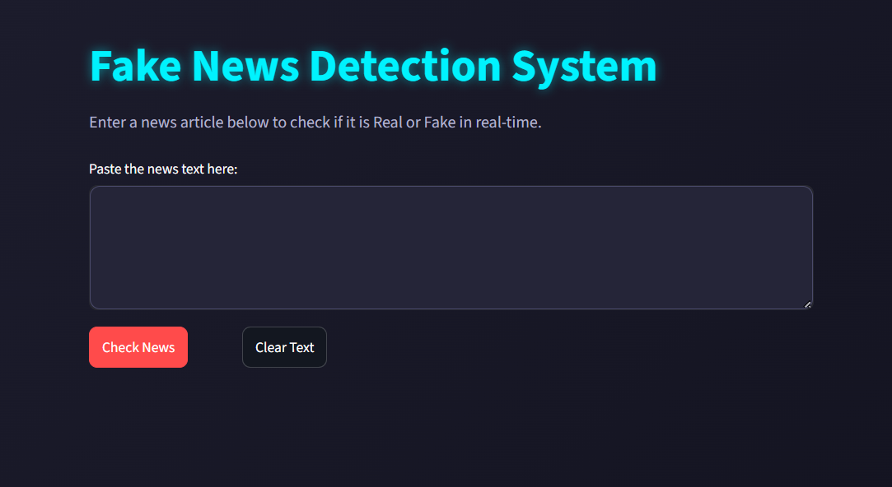
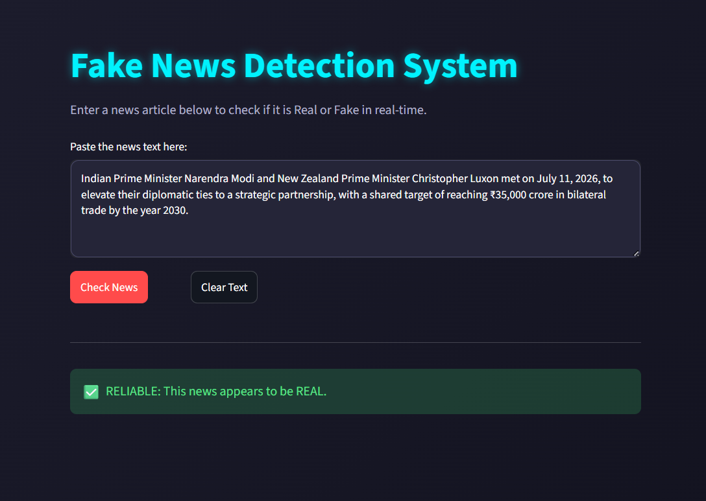

#  Fake News Detection System Using Machine Learning

A robust, production-ready Machine Learning web application designed to classify news articles as **REAL** or **FAKE** in real-time. This project implements advanced Natural Language Processing (NLP) techniques for text preprocessing and utilizes a supervised classification pipeline to identify structural writing patterns common in misinformation.

---

##  Key Features

- **Real-Time Classification**: Instantly evaluate the authenticity of any news article by pasting the raw text.
- **Modern UI/UX Dashboard**: Built with a custom interactive dark-gradient interface using Streamlit.
- **Smart Text Management**: Features a specialized "1-Click Clear Text" utility to efficiently flush lengthy multi-paragraph inputs.
- **Advanced Text Preprocessing**: Cleans raw text datasets by stripping punctuation, special characters, URLs, HTML tags, and normalizing inputs for optimized feature extraction.
- **Production-Ready Pipeline**: Utilizes TF-IDF vectorization paired with a high-performance Logistic Regression classifier.

---

##  Tech Stack & Architecture

- **Programming Language**: Python 
- **Machine Learning Framework**: Scikit-Learn
- **Data Manipulation**: Pandas
- **Web Interface**: Streamlit
- **Serialization**: Pickle
- **Development Environment**: Visual Studio Code (VS Code)

---

##  Project Directory Structure

```text
Fake_News_Detector/
│
├── True.csv             # Dataset file containing verified, authentic real news articles
├── Fake.csv             # Dataset file containing misleading or fabricated fake news articles
├── train_model.py       # Python core script for data preprocessing, ingestion, and model training
├── app.py               # Main interactive Streamlit web UI application dashboard script
├── requirements.txt     # Global dependencies and package version configuration file
├── model.pkl            # Serialized binary configuration for the trained Logistic Regression weights
└── vectorizer.pkl       # Serialized configuration for the fitted TF-IDF Vectorizer vocabulary
```
## Dataset Specifications

The predictive engine is trained on a highly comprehensive benchmarking dataset containing 44,000+ real-world news records uniformly distributed across distinct categories:

* Real Articles: 21,417 authentic records (focusing heavily on world news, politics, and established journalism).

* Fake Articles: 23,481 verified misleading records (capturing clickbait phrasing, exaggerated punctuation, and structural misinformation indicators).

## How to Run Locally (Step-by-Step Guide)
Follow these precise steps to set up, configure, and execute this project on your local operating environment:

## 1. Project Directory Ingestion
Extract the project package files, open Visual Studio Code, and navigate directly into the root folder:

* Bash --- cd Fake_News_Detector
Ensure that you downloaded True.csv and Fake.csv dataset files are placed explicitly within this primary folder.

## 2. Environment Dependencies Installation
Open your integrated VS Code terminal and execute the following command to download and install all required external libraries:

* Bash --- pip install -r requirements.txt
## 3. Model Pipeline Execution (Training Phase)
Run the automated core training script to combine datasets, run text-cleaning routines, optimize features, and generate system weights:

* Bash --- python train_model.py

## 4. Running the Interactive Dashboard
To execute the graphical interface wrapper safely without encountering environment variable path restrictions on Windows, launch the application utilizing the standard Python module wrapper flag:

* Bash --- python -m streamlit run app.py
## 5. Accessing the Deployment Instance
Once executed successfully, a local hosting server interface will be established. The system will open your web browser automatically. If it does not open, visit:

* Plaintext
http://localhost:8501


##  Functional Workflow & Screen Previews

### 1. Primary Ingestion Interface Layout


### 2. Output: FAKE Classification Indicator


### 3. Output: REAL Classification Indicator


## Implementation Boundaries & Future Scope
* Temporal Constraint: The primary training parameters are fitted using standard benchmarking records representing political text structure timelines.

* Pattern Learning vs. Live Fact-Checking: The core algorithm classifies text by identifying linguistic irregularities and text styling features characteristic of fake news articles, rather than verifying live historical facts.

* Future Integration Vector: Upcoming versions will integrate automatic web-scraping utilities and incremental live-weight fitting to adapt continuously to newly emerging modern writing styles dynamically.
